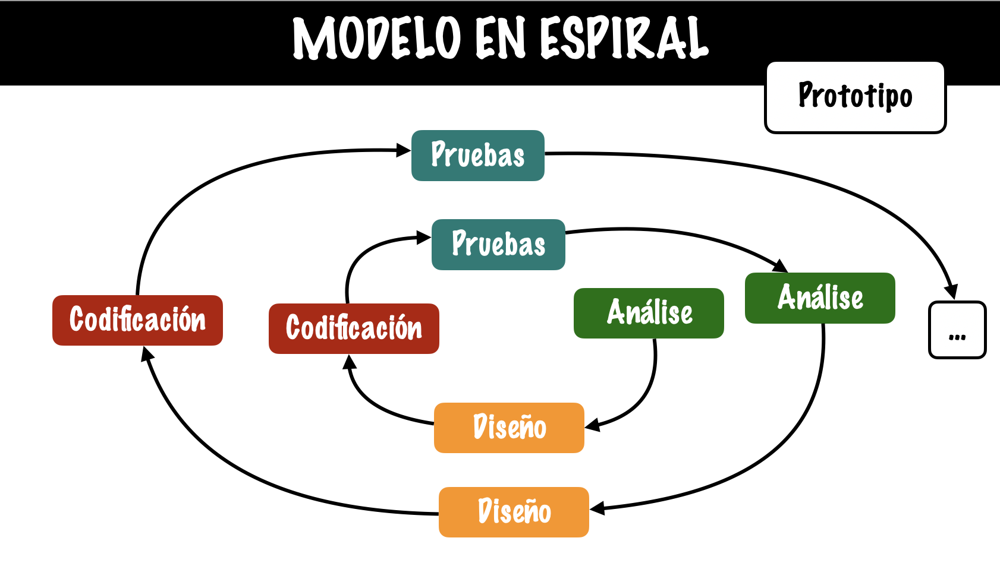

# Markdown

Markdown es un lenguaje de marcado ligero que se utiliza para dar formato a los documentos de texto. Es fácil de aprender y usar, y se utiliza comúnmente para crear documentos de texto simples, como notas, correos electrónicos y páginas web. El lenguaje Markdown utiliza una sintaxis simple y fácil de recordar para dar formato al texto, lo que lo hace ideal para aquellos que no tienen experiencia en programación o diseño web. Algunos de los elementos básicos de la sintaxis de Markdown incluyen encabezados, párrafos, listas, enlaces e imágenes. Además, Markdown también admite la creación de tablas, bloques de código y fórmulas matemáticas utilizando LaTeX. 

## Tabla de contenido

Generar Índice en Markdown 
1. Elemento 1
2.  Elemento 2
    - Elemento 2.1
    - Elemento 2.2
        1. Elemento 2.2.1
        2. Elemento 2.2.2

### Titulos 

Intertar hasta 5 niveles de títulos 
# Encabezado 1
## Encabezado 2
### Encabezado 3
#### Encabezado 4
##### Encabezado 5
###### Encabezado 6

### Cursivas

*Frase en cursiva*

### Negrilla

**Frase en negrita**

### Vinetas

Lista numerada
1. Elemento 1
2. Elemento 2
3. Elemento 3
4. Elemento 4

Lista no numerada
- Elemento 1
- Elemento 2
- Elemento 3
- Elemento 4

## Párrafos y saltos de línea

Insertar un

salto de línea

### Insertar imagenes

### Insertar enlaces

[IESSanClemente](https://www.iessanclemente.net/)

### Hacer anclaje

[Inicio](#markdown)

### Insertar una linea de codigo

~~~
 public class ejercicio2 {
    public static void main(String[] args) {
        Scanner escaner = new Scanner(System.in);
        String[] nomes = new String[4];
        for (int i = 0; i < nomes.length; i++) {
            System.out.print("Introduce o nome da persoa " + (i + 1) + ": ");
            nomes[i] = escaner.nextLine();
        }
        String saudo = "Ola ";
        for (int i = 0; i < nomes.length; i++) {
            saudo += nomes[i];
            if (i < nomes.length - 1) {
                saudo += ", ";
            }
        }
        saudo += "!";
        System.out.println(saudo);

        escaner.close();
    }
 }
~~~ 

### Insertar tablas

Insertar una tabla 
| Columna 1 | Columna 2 | Columna 3 |
|----------|----------|----------|
| 1        | 1        | 1        |
| 2        | 2        | 2        |
| 3        | 3        | 3        |

### Editores en Markdown 

Enlaces a editores en Markdown

[Dillinger](https://dillinger.io/)

[Draft](https://draftin.com/)

[Typora](https://typora.io/) 

### Otras referencias sobre Markdown

https://docs.github.com/es/get-started/writing-on-github/getting-started-with-writing-and-formatting-on-github/basic-writing-and-formatting-syntax

https://www.markdownguide.org/getting-started/

https://www.mkdocs.org/

